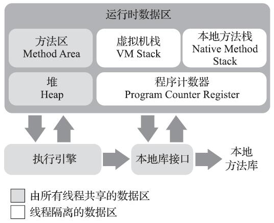

# Java虚拟机

## visualvm使用

开启远程功能，启动时加上参数

```shell
-Dcom.sun.management.jmxremote=true
-Djava.rmi.server.hostname=192.168.50.59
-Dcom.sun.management.jmxremote.port=3333
-Dcom.sun.management.jmxremote.ssl=false
-Dcom.sun.management.jmxremote.authenticate=false
```

## 双亲委派机制

https://www.cnblogs.com/hollischuang/p/14260801.html

## JVM参数

打印GC日志

-XX:+PrintCodeCache   jvm关闭时输出code cache

### JFR

应用启动时开启JFR

```shell
java -XX:+UnlockCommercialFeatures -XX:+FlightRecorder -XX:StartFlightRecording=duration=60s,filename=myrecording.jfr MyMainClass
```

如果您使用的是Java 11及更高版本，您可以使用以下命令来开启JFR：

```shell
java -XX:StartFlightRecording=duration=60s,filename=myrecording.jfr MyMainClass
```


#### Java代码开启JFR

源自于chat gpt

```java
import javax.management.MBeanServer;
import javax.management.MBeanServerConnection;
import javax.management.ObjectName;
import java.lang.management.ManagementFactory;
import java.util.HashMap;
import java.util.Map;

public class JFRDemo {

    public static void main(String[] args) throws Exception {

        // Get the platform MBean server
        MBeanServer server = ManagementFactory.getPlatformMBeanServer();

        // Construct the JFR MXBean ObjectName
        ObjectName objName = new ObjectName("jdk.management.jfr:type=FlightRecorder");

        // Create the recording options
        Map<String, String> options = new HashMap<>();
        options.put("name", "MyRecording");
        options.put("settings", "profile");

        // Start the recording
        server.invoke(objName, "startRecording", new Object[]{options}, new String[]{"java.util.Map"});
    }
}

```


## 问题收集 

对象从年轻代晋升老年代时，如果对象是集合对象，那么其关联的对象是否也会一起晋升？

扫描年轻代，是不是意味着有地方记录了各个分代的对象地址？对象占用空间是不是可以计算的，要不然如何知道要回收多少空间？

## 运行时数据区域

