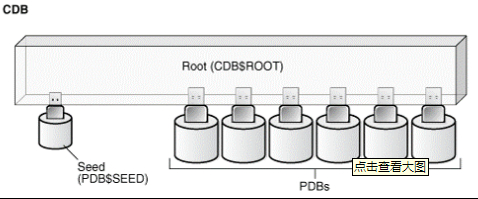

# Oracle

## 安装

参考 https://blog.51cto.com/10316297/2140427?source=dra

## 启动

1. 以oralce用户登录

   `su oracle`

2. 打开监听服务
   
```bash
lsnrctl start
```

3. 查看监听器运行状况
   
```bash
lsnrctl status
```

4. 以sys用户登录oracle

	sqlplus /nolog
	conn / as sysdba

5. 启动实例

   `startup`

   

## 关闭

1. 关闭数据库实例 

   ```bash
   shutdown
   ```

2. 关闭监听 

   ```bash
   lsnrctl stop
   ```

## CBD、PDB

	

​	The data dictionary in each container in a CDB is separate, and the current container is the container whose data dictionary is used for name resolution and for privilege authorization. The current container can be the root or a PDB. Each session has exactly one current container at any point in time, but it is possible for a session to switch from one container to another.

​	CDB中每个容器中的数据字典是独立的，当前容器是其数据字典用于名称解析和权限授权的容器。 当前容器可以是根或 PDB。 每个会话在任何时间点都恰好有一个当前容器，但会话有可能从一个容器切换到另一个容器。

​	Each container has a unique ID and name in a CDB. You can use the CON_ID and CON_NAME parameters in the USERENV namespace to determine the current container ID and name with the SYS_CONTEXT function.

​	每个容器在 CDB 中都有唯一的 ID 和名称。 您可以使用 USERENV 命名空间中的 CON_ID 和 CON_NAME 参数通过 SYS_CONTEXT 函数确定当前容器 ID 和名称。


**查看pdb**

`show pdbs`

**切换当前容器**

`alter session set container=pdb1`

**启动创建好的pdb**

`alter pluggable database pdb1 open;`

**问题1**

`oracle12c CDB下创建用户表空间ORA-65096，ORA-65048，ORA-00959`

https://blog.csdn.net/oFengYuan123456/article/details/81453446

## 常用sql

**版本查看**

```sql
select * from V$VERSION
```

## 创建用户

create user universe identified by cc;

## 常见问题处理

**ORA-12705 无效的NLS参数设置**

select * from V$NLS_PARAMETERS


## 查看表空间

1、查询数据库中所有的表空间以及表空间所占空间的大小，直接执行语句就可以了：

```sql
select tablespace_name, sum(bytes)/1024/1024 from dba_data_files group by tablespace_name;
```

2、查看表空间物理文件的名称及大小   

```sql
select tablespace_name, file_id, file_name,   
round(bytes/(1024*1024),0) total_space   
from dba_data_files   
order by tablespace_name; 
```


3、查询所有表空间以及每个表空间的大小，已用空间，剩余空间，使用率和空闲率，直接执行语句就可以了：

```sql
select a.tablespace_name, total, free, total-free as used, substr(free/total * 100, 1, 5) as "FREE%", substr((total - free)/total * 100, 1, 5) as "USED%" from 
(select tablespace_name, sum(bytes)/1024/1024 as total from dba_data_files group by tablespace_name) a, 
(select tablespace_name, sum(bytes)/1024/1024 as free from dba_free_space group by tablespace_name) b
where a.tablespace_name = b.tablespace_name
order by a.tablespace_name;
```

4、查询某个具体的表所占空间的大小，把“TABLE_NAME”换成具体要查询的表的名称就可以了：

```sql
select t.segment_name, t.segment_type, sum(t.bytes / 1024 / 1024) "占用空间(M)"
from dba_segments t
where t.segment_type='TABLE'
and t.segment_name='TABLE_NAME'
group by OWNER, t.segment_name, t.segment_type;
```

